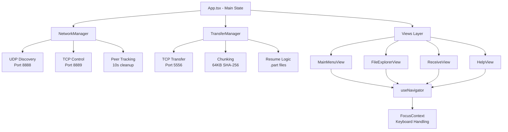

# Developer Guide

This guide provides technical details for developers working on TUI-AirDrop,
including architecture, setup, and contribution guidelines.

## Project Architecture

TUI-AirDrop uses a decoupled architecture separating networking logic (Core)
from the user interface (Views/Components).

### Core Components

- **NetworkManager** (`src/core/NetworkManager.ts`): Handles peer discovery via
  UDP broadcasts, maintains a peer map with cleanup, manages session tokens, and
  emits events for UI updates.
- **TransferManager** (`src/core/TransferManager.ts`): Implements a custom
  binary protocol for secure chunked file transfers with SHA-256 integrity
  checks and resume support.

### UI Layer

- **Framework**: [Ink](https://github.com/vadimdemedes/ink) for React-based
  terminal UI.
- **Navigation**: Custom `useNavigator` hook in `src/core/Navigation.tsx` for
  view stack management.
- **Focus Management**: `FocusContext.tsx` ensures proper keyboard handling in
  terminal apps.

### System Architecture Diagram



## Technology Stack

- **Runtime**: [Bun](https://bun.sh/) for fast development and execution
- **UI Framework**: [Ink](https://github.com/vadimdemedes/ink) (React for CLI)
- **Language**: TypeScript for type safety
- **Security**: Node.js `crypto` module for SHA-256 hashing
- **Networking**: Node.js `net` (TCP) and `dgram` (UDP) modules
- **Build Tool**: Bun's built-in bundler

## Development Setup

### Prerequisites

- [Bun](https://bun.sh/) installed
- Git

### Setup Steps

1. Clone the repository:

   ```bash
   git clone https://github.com/yourusername/TUI-AirDrop.git
   cd TUI-AirDrop
   ```

2. Install dependencies:

   ```bash
   bun install
   ```

3. Start development mode:
   ```bash
   bun run dev
   ```

### Building

Build for production:

```bash
bun run build
```

### Testing

Run unit tests:

```bash
bun test
```

Tests focus on core managers; network tests mock sockets to avoid port
conflicts.

## Common Development Tasks

### Adding a New Message Type

1. Update `handleControlMessage` in `NetworkManager.ts`.
2. Ensure client-side `requestFile` handles the new response.
3. Add corresponding interface in `NetworkManager.ts`.

### Changing Chunk Size

Modify `CHUNK_SIZE` in `TransferManager.ts`. **Important**: Both host and client
must use the same chunk size for resume logic to work.

### Modifying Views

UI state is lifted to `App.tsx` and passed down. Update state management there
when adding new views.

## Development Guidelines

- **Strict Typing**: Use interfaces for all events and data structures. Avoid
  `any`.
- **Backpressure**: Respect `socket.write()` return value and wait for `drain`
  event.
- **Path Handling**: Support Windows and POSIX paths; use `path.basename()` for
  filenames.
- **TUI Design**: Use Ink's `Box` for layout; avoid `console.log` in views
  (breaks rendering).

## Contributing

1. Fork the repository.
2. Create a feature branch: `git checkout -b feature/your-feature`.
3. Make changes following the guidelines above.
4. Add tests for new functionality.
5. Run `bun test` to ensure passing tests.
6. Submit a pull request with a clear description.

### Code Style

- Use TypeScript strict mode.
- Follow existing naming conventions.
- Keep functions small and focused.
- Document complex logic with comments.

## API Reference

### NetworkManager

#### Interfaces

- **Peer**:
  `{ displayName: string; ip: string; offering: { filename: string; size: number; filePath?: string } | null; lastSeen: number }`
- **FileRequest**:
  `{ fromIp: string; fileName: string; filePath: string; approve: (approved: boolean) => void }`
- **TransferReadyInfo**:
  `{ approved: true; token: string; host: string; port: number; filename: string; size: number; filePath: string }`

#### Events (NetworkManagerEvents)

- `peerUpdate: (peers: Peer[]) => void` - Emitted when peer list changes.
- `fileRequest: (req: FileRequest) => void` - Incoming file request requiring
  approval.
- `transferReady: (info: TransferReadyInfo) => void` - Transfer approved and
  ready to start.
- `transferProgress: (info: TransferInfo) => void` - Transfer progress update.
- `transferComplete: (info: { filename: string; savePath: string }) => void` -
  Transfer finished successfully.
- `transferError: (info: { filename: string; error: string }) => void` -
  Transfer failed.

#### Key Methods

- `startDiscovery()`: Begin broadcasting and listening for peers.
- `requestFile(peerIp: string, fileName: string): Promise<TransferReadyInfo | null>`:
  Request a file from a peer.
- `downloadFile(transferInfo: TransferReadyInfo, savePath: string): Promise<void>`:
  Start receiving a file.

### TransferManager

#### Interfaces

- **PacketHeader**:
  `{ seq: number; size: number; hash: string; isLast: boolean }`
- **TransferInfo**:
  `{ filename: string; size: number; progress: number; speed: number; status: "pending" | "active" | "paused" | "complete" | "error"; error?: string; savePath?: string }`

#### Events (TransferManagerEvents)

- `transferProgress: (info: TransferInfo) => void` - Progress update during
  transfer.
- `transferComplete: (info: { filename: string; savePath: string }) => void` -
  Transfer completed.
- `transferError: (info: { filename: string; error: string }) => void` -
  Transfer error occurred.

#### Key Methods

- `receiveFile(host: string, token: string, savePath: string, filename: string, totalSize: number): Promise<void>`:
  Receive a file from host.
- `getActiveTransfers(): TransferInfo[]`: Get list of ongoing transfers.
