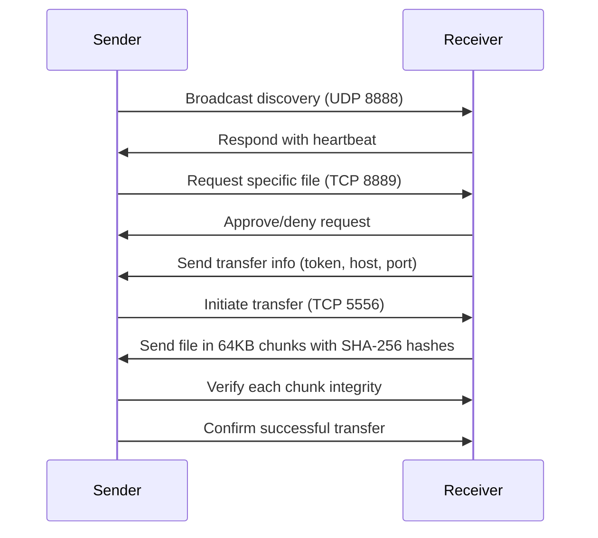

# User Guide

Welcome to TUI-AirDrop! This guide will help you get started with sending and
receiving files securely over your local network using a terminal interface.

## System Requirements

- **Runtime**: [Bun](https://bun.sh/) (recommended) or Node.js 18+
- **Operating System**: Windows 10+, macOS 10.15+, or Linux
- **Terminal**: A terminal that supports ANSI colors and cursor positioning
  (most modern terminals do)
- **Network**: Local network access (Wi-Fi or Ethernet) for peer discovery

## Installation

### Windows

1. Download and install Bun from [bun.sh](https://bun.sh/).
2. Open Command Prompt or PowerShell.
3. Clone the repository:
   ```bash
   git clone https://github.com/yourusername/TUI-AirDrop.git
   cd TUI-AirDrop
   ```
4. Install dependencies:
   ```bash
   bun install
   ```

### macOS

1. Install Bun using Homebrew:
   ```bash
   brew install oven-sh/bun/bun
   ```
2. Clone and install as above.

### Linux

1. Install Bun:
   ```bash
   curl -fsSL https://bun.sh/install | bash
   ```
2. Clone and install as above.

## Running the Application

Start TUI-AirDrop with:

```bash
bun run index.tsx
```

The terminal interface will launch, showing the main menu.

## Using TUI-AirDrop

### Navigation

- **Arrow Keys**: Navigate menus and lists
- **Enter**: Select an option or confirm
- **Esc**: Go back to the previous screen
- **Tab**: Switch between input fields (in forms)

### Sending Files

1. From the main menu, select **"Send Files"**.
2. Use the file explorer to navigate to and select files or directories.
3. Choose recipients from the list of discovered peers.
4. Confirm the transfer to start sending.

### Receiving Files

1. Select **"Receive Files"** from the main menu.
2. The app will listen for incoming requests.
3. When a request arrives, approve or deny it.
4. If approved, choose a save location for the file.
5. The transfer will begin automatically.

### Settings

Access **"Settings"** to configure:

- Display name (how others see you)
- Sharing mode (auto-approve or manual)
- Other preferences

### In-App Help

Select **"Help"** from the main menu for a built-in guide with navigation tips
and troubleshooting.

## File Transfer Workflow

The following diagram illustrates the file transfer process:



Transfers are secure with token-based authentication and real-time integrity
checking.
